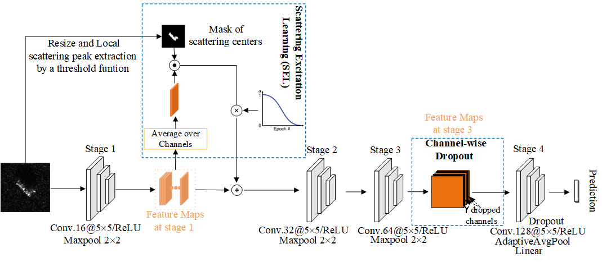

## Occluded Target Recognition in SAR Imagery withScattering Excitation Learning and Channel Dropout

# Introduction
We propose a novel robust SAR recognition method against occlusion. Specifically, 
we design a scattering excitation learning module that encourages the network to 
learn more robust features responding to the scattering centers of targets. 
In addition, we adopt a random feature channel dropout technique which can 
further improve robustness to occlusion. Our method makes the network more 
robust against occlusion but without any occlusion-simulated data for training. 


<p align="center">The whole framework of the proposed approach that integrates SEL and channel-wise dropout.</p>

# Prerequisites
Python 3.7.7

torch == 1.10.0+cu102

torchvision== 0.11.0+cu102

opencv-python == 4.6.0

***The environment must be strict***

# Getting Started
1.Dataset download
+ MSTAR can be downloaded [here](https://pan.baidu.com/s/103kb3sg65iSY87gGqadpBA) 提取码：lzad 

You could download datasets and put them in `./data` folder for train and evaluation.

2.Training

```
python train.py --dataset MSTAR
```

3.Evaluation

+ The trained model has been placed in `./chkpt` folder.

+ You can directly evaluate the MSTAR dataset.

```
python test.py --dataset MSTAR
```
